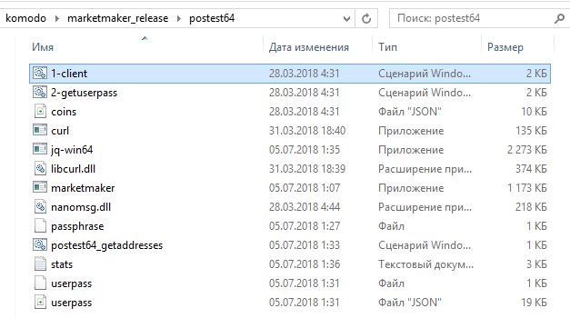

### How to participate in POSTEST64? ###
**Mini HOW-TO for Windows users by Decker**

**Q.** What i need to prepare?

- First of all you'll need to build `marketmaker`. Make sure you have `git`, `cmake` and `msvc 2015` installed.
- Clone this repo: `git clone https://github.com/jl777/SuperNET`
- Change the branch: `git checkout dev`
- Build dependensies: `marketmaker_build_depends.cmd`
- Build marketmaker: `marketmaker_build_32_64.cmd`
- Make a new dir, for example, `posttest64` and copy following files in it:

	- `.\x64\Release\marketmaker.exe` 
	- `.\marketmaker_depends\curl\build_msvc_2015_win64\lib\Release\libcurl.dll`
	- `.\marketmaker_depends\nanomsg\build_msvc_2015_win64\Release\nanomsg.dll`
	- `.\iguana\dexscripts.win32\1-client.cmd`
	- `.\iguana\dexscripts.win32\2-getuserpass.cmd`
	- `.\iguana\dexscripts.win32\postest64_getaddresses.cmd`
	- `.\marketmaker_depends\curl\build_msvc_2015_win64\src\Release\curl.exe`
	- `.\iguana\exchanges\coins.json`
	
- Create `passphrase` file in a same dir, containing your secret strong passphrase.
- Launch `1-client.cmd`, it will start marketmaker and "login" with `default` passphrase. Wait 10-15 sec to allow marketmaker start. If Windows firewall will ask you about connections - allow it.
- Launch `2-getuserpass.cmd` to "login" with your passphrase, it will push your passphrase from `passphrase` file to marketmaker and fills `userpass` file with your userpass.
- Download `jq` from https://stedolan.github.io/jq/ or with this direct link - [jq 1.5](https://github.com/stedolan/jq/releases/download/jq-1.5/jq-win64.exe "jq 1.5") and place `jq-win64.exe` in a same folder with other files (mean  `posttest64` folder).
- Make sure the  `posttest64` folder have all needed:

-  Launch `postest64_getaddresses.cmd`, it will create `SENDTOALRIGHT.txt` file with 64 addresses (segids) corresponding your passphrase.
-  Check and follow this guide https://github.com/Alrighttt/POSTEST64 .

**Q.** Where i can get needed stuff, mean Git, Cmake and MSVC 2015 for my PC?

- `MSVC 2015 (Visual Studio 2015)` - https://stackoverflow.com/questions/44290672/how-to-download-visual-studio-community-edition-2015-not-2017 . 
- `Git for Windows` - https://git-scm.com/download/win
- `Cmake` - https://cmake.org/download/

Make sure that you have **64-bit** OS and 64-bit versions of all stuff.
